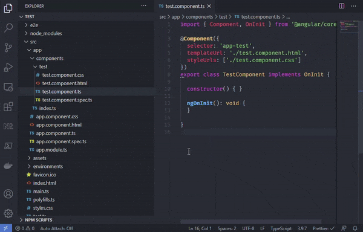

# Export-This for Visual Studio Code

An extension for Visual Studio code to easily export TypeScript definitions to your index.ts files.

## Install

1. Open **Extensions** sideBar panel in Visual Studio Code and choose the menu options for **View → Extensions**
1. Search for `Export-This`
1. Click **Install**
1. Click **Reload**, if required

## Quick Usage

1. Create an index.ts file next to or in a folder under the TypeScript file you are working on.
1. The index.ts file can be as deep as you like, as long as it is in your workspace folder.
1. Go to the declaration you wish to export (class, interface, enum etc.)
1. Hit the quick fix **Ctrl+Period** and select **Export file**.
1. The index.ts file will now be opened and the current file will be expored.
1. Hit save and done!

## Issues

Feel free to report an issues or feature requests!
